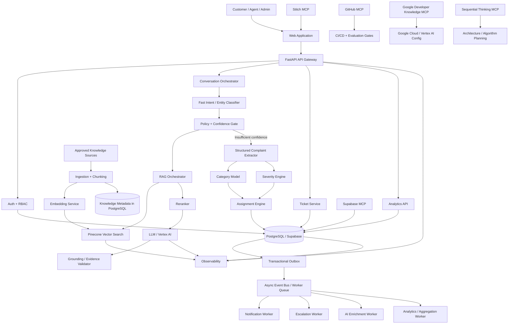
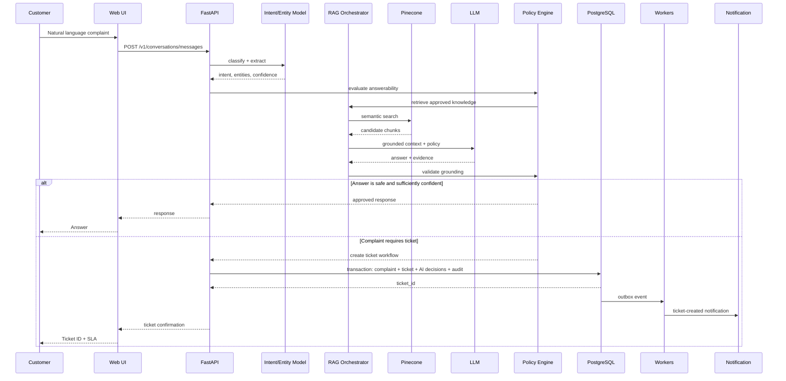
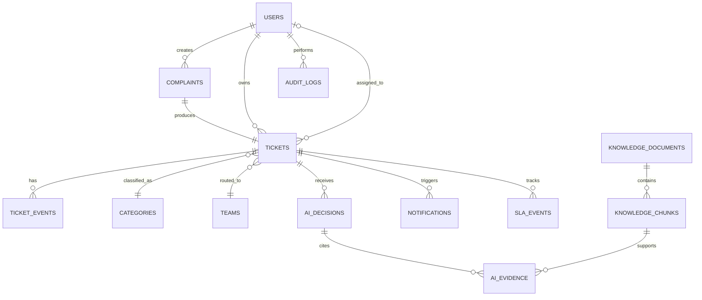
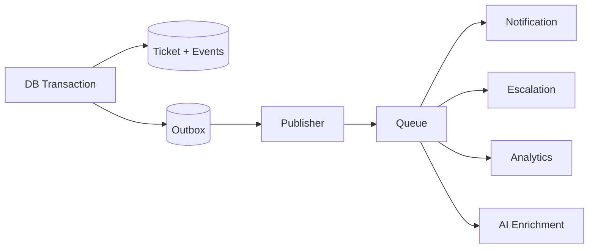
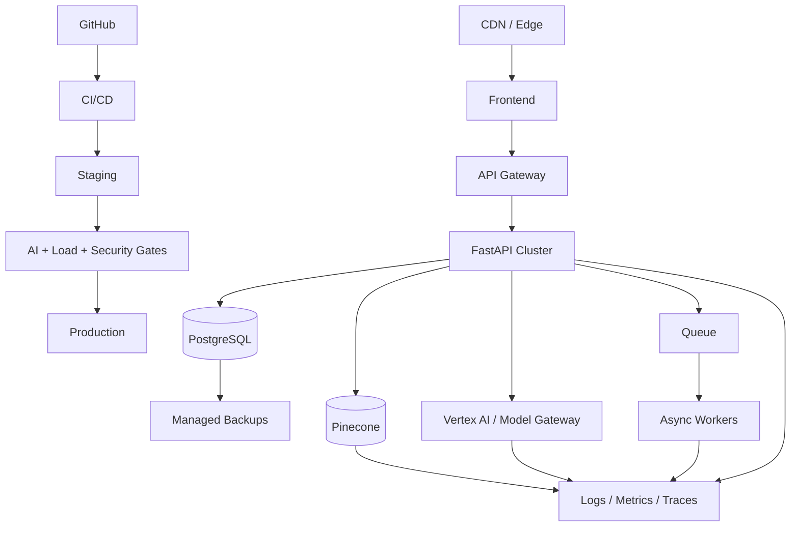

# ARCHITECTURE — Intelligent Complaint Management & AI Ticketing Platform

**Problem Code:** P-004  
**Architecture Style:** Modular monolith evolving toward event-driven services  
**Execution Engine:** Google Anti-Gravity autonomous execution/orchestration layer  
**Backend:** Python + FastAPI + Pydantic  
**System of Record:** PostgreSQL / Supabase  
**Vector Retrieval:** Pinecone  
**AI Platform:** Google Cloud / Vertex AI-compatible services  
**UI Scaffolding:** Stitch MCP  
**Source Control:** GitHub MCP

---

# 1. Architectural Principles

1. **System of record first.** PostgreSQL owns identity, tickets, state, policy, audit, and transactional relationships.
2. **Probabilistic AI, deterministic control.** Models recommend; policy engines authorize.
3. **Retrieval is evidence, not truth.** Pinecone accelerates semantic search but authoritative content remains in governed sources.
4. **Every AI action is observable.**
5. **Async by default for expensive work.**
6. **Hard constraints before optimization.**
7. **Fail closed for privileged operations.**
8. **Human override is a first-class state transition.**
9. **Version everything that can affect an AI decision.**
10. **Design for replay.** Production interactions should be replayable against future model versions without mutating live state.

---

# 2. Complete System Architecture



---

# 3. Request/Data Flow



---

# 4. Frontend Architecture

## 4.1 Application Modules

```text
src/
  app/
    (customer)/
      chat/
      tickets/
      profile/
    (agent)/
      queue/
      tickets/
    (admin)/
      dashboard/
      analytics/
      policies/
      models/
  components/
    chat/
    tickets/
    status-timeline/
    severity-badge/
    assignment-panel/
    ai-explanation/
    analytics/
  lib/
    api-client/
    realtime/
    auth/
    telemetry/
```

## 4.2 Critical UI Components

### Conversational Intake

- Streaming assistant response.
- Structured clarification cards.
- Attachment/evidence state.
- Ticket creation preview.
- AI confidence should not be presented as a misleading probability of "truth."

### Ticket Timeline

Display:

- State transitions.
- Assignment events.
- SLA events.
- Escalations.
- Customer messages.
- Agent actions.

### Agent Workspace

Three-pane model:

1. Complaint context.
2. AI intelligence:
   - category recommendation,
   - severity rationale,
   - retrieved evidence,
   - similar cases.
3. Operational controls:
   - assign,
   - escalate,
   - resolve,
   - request information.

### Admin Analytics

- Queue heatmap.
- SLA-risk list.
- Category distribution.
- Complaint clusters.
- AI override trends.
- Model performance by slice.

---

# 5. FastAPI Modular Backend

```text
backend/
  app/
    api/
      v1/
        auth.py
        conversations.py
        complaints.py
        tickets.py
        assignments.py
        notifications.py
        analytics.py
        admin.py
    domain/
      complaint/
      ticket/
      assignment/
      escalation/
      policy/
      knowledge/
    services/
      conversation_orchestrator.py
      ticket_service.py
      severity_service.py
      routing_service.py
      rag_service.py
      notification_service.py
    ml/
      classifiers/
      embeddings/
      reranking/
      evaluation/
      registry/
    repositories/
    workers/
    observability/
    schemas/
```

---

# 6. Pydantic Contracts

## Create Conversation Message

```python
class ConversationMessage(BaseModel):
    conversation_id: UUID | None = None
    text: constr(min_length=1, max_length=8000)
    language: str | None = None
    client_message_id: UUID
```

## AI Decision

```python
class AIDecision(BaseModel):
    decision_type: Literal[
        "intent", "category", "severity", "routing", "retrieval", "response"
    ]
    value: dict
    confidence: confloat(ge=0.0, le=1.0)
    model_name: str
    model_version: str
    policy_version: str
    evidence_ids: list[UUID] = []
```

## Ticket Creation

```python
class TicketCreate(BaseModel):
    complaint_text: constr(min_length=1, max_length=20000)
    category_id: UUID
    severity: Literal["LOW", "MEDIUM", "HIGH", "URGENT"]
    source: Literal["CHATBOT", "WEB", "AGENT", "API"]
    extracted_entities: dict
    ai_decision_id: UUID | None = None
```

## Assignment Recommendation

```python
class AssignmentRecommendation(BaseModel):
    team_id: UUID
    agent_id: UUID | None
    score: confloat(ge=0.0, le=1.0)
    hard_constraints_satisfied: bool
    rationale: list[str]
    model_version: str
```

---

# 7. API Surface

| Endpoint | Method | Purpose |
|---|---|---|
| `/v1/conversations` | POST | Start conversation |
| `/v1/conversations/{id}/messages` | POST | Send message |
| `/v1/conversations/{id}` | GET | Retrieve conversation |
| `/v1/tickets` | POST | Create ticket |
| `/v1/tickets/{id}` | GET | Ticket details |
| `/v1/tickets/{id}/events` | GET | Timeline |
| `/v1/tickets/{id}/assign` | POST | Assign |
| `/v1/tickets/{id}/escalate` | POST | Escalate |
| `/v1/tickets/{id}/resolve` | POST | Resolve |
| `/v1/agents/queue` | GET | Work queue |
| `/v1/analytics/overview` | GET | Operational metrics |
| `/v1/admin/models` | GET | Model metadata |
| `/v1/admin/policies` | GET | Policy configuration |

Use idempotency keys on externally retried mutation endpoints.

---

# 8. PostgreSQL / Supabase Schema



## Core Tables

### users

- `id UUID PK`
- `tenant_id UUID`
- `role`
- `email`
- `status`
- `created_at`

### complaints

- `id UUID PK`
- `user_id FK`
- `conversation_id`
- `raw_text`
- `normalized_text`
- `language`
- `created_at`

### tickets

- `id UUID PK`
- `complaint_id FK UNIQUE`
- `category_id FK`
- `severity`
- `status`
- `team_id FK`
- `assigned_agent_id FK NULL`
- `sla_due_at`
- `resolved_at`
- `version BIGINT`
- `created_at`
- `updated_at`

### ticket_events

- `id UUID PK`
- `ticket_id FK`
- `event_type`
- `actor_type`
- `actor_id`
- `payload JSONB`
- `created_at`

### ai_decisions

- `id UUID PK`
- `ticket_id FK`
- `decision_type`
- `model_name`
- `model_version`
- `policy_version`
- `confidence`
- `output JSONB`
- `created_at`

### ai_evidence

- `id UUID PK`
- `ai_decision_id FK`
- `knowledge_chunk_id`
- `similarity_score`
- `rank`
- `metadata JSONB`

### knowledge_documents

- `id UUID PK`
- `source_uri`
- `title`
- `authority_level`
- `version`
- `checksum`
- `status`
- `created_at`

### knowledge_chunks

- `id UUID PK`
- `document_id FK`
- `chunk_index`
- `content`
- `content_hash`
- `embedding_model`
- `embedding_version`

### agents

- `id UUID PK`
- `team_id`
- `availability_status`
- `capacity`
- `current_load`
- `language_codes`
- `skills JSONB`

### audit_logs

- `id UUID PK`
- `actor_id`
- `action`
- `resource_type`
- `resource_id`
- `before JSONB`
- `after JSONB`
- `request_id`
- `created_at`

Use indexes on:

- `(tenant_id, status, severity)`
- `(team_id, status, sla_due_at)`
- `(assigned_agent_id, status)`
- `(created_at)`
- `(ticket_id, created_at)` on event tables

---

# 9. Pinecone Vector Architecture

Namespaces should separate lifecycle and tenant boundaries where required:

```text
knowledge-prod-{tenant}
knowledge-staging-{tenant}
historical-cases-{tenant}
```

Vector metadata:

```json
{
  "document_id": "uuid",
  "chunk_id": "uuid",
  "tenant_id": "uuid",
  "document_version": 12,
  "authority_level": "approved",
  "language": "en",
  "product": "billing",
  "embedding_model": "versioned-model-id"
}
```

Never trust vector metadata alone for authorization. Re-check authorization against authoritative relational metadata.

---

# 10. Deep ML/DL Pipeline

## 10.1 Preprocessing

Pipeline:

```text
Raw text
  ↓
Unicode normalization
  ↓
Language identification
  ↓
PII-aware redaction/tokenization where policy requires
  ↓
Whitespace / markup normalization
  ↓
Entity extraction
  ↓
Intent classification
  ↓
Feature construction
```

Do not aggressively remove punctuation or numbers: ticket severity can depend on identifiers, error codes, quantities, dates, and version strings.

---

# 11. Category Model

Let complaint representation be:

`h = Encoder(x)`

For K categories:

`p(y=k|x) = softmax(W h + b)_k`

Training objective:

`L_category = - Σ_i Σ_k y_ik log p_ik`

For class imbalance, use weighted cross entropy or focal loss:

`L_focal = - α_k (1-p_t)^γ log(p_t)`

Use stratified temporal validation rather than random-only splitting.

---

# 12. Severity Model

Severity is a hybrid decision.

Let:

`z = [h, impact, duration, affected_scope, service_criticality, recurrence, urgency_signal]`

Model:

`p(s|z) = softmax(W_s z + b_s)`

Operational severity:

`S_operational = Policy(p(s|z), hard_signals, SLA_class)`

A deterministic override may elevate severity when an approved criticality rule is triggered.

This avoids the unsafe architecture in which an LLM can downgrade a critical complaint because of wording.

---

# 13. Assignment Algorithm

Let candidate agent `a` and ticket `t`.

First apply hard constraints:

`H(a,t) ∈ {0,1}`

where constraints include skill eligibility, active status, authorization, shift, language, and team ownership.

Then:

`Score(a,t) = Σ_j w_j f_j(a,t)`

Example:

- skill match
- normalized available capacity
- current workload
- historical resolution-time percentile
- SLA compatibility
- language match

Choose:

`a* = argmax_a Score(a,t), subject to H(a,t)=1`

If no candidate exists, route to overflow/escalation rather than forcing an invalid assignment.

---

# 14. RAG Pipeline

```text
Query
 ↓
Query normalization
 ↓
Embedding
 ↓
Pinecone top-K
 ↓
Metadata filtering
 ↓
Optional lexical/hybrid retrieval
 ↓
Cross-encoder/reranker
 ↓
Authority + freshness filter
 ↓
Context packing
 ↓
LLM generation
 ↓
Claim/evidence validation
 ↓
Policy gate
 ↓
Response OR ticket
```

## Retrieval objective

For relevant document `d` and query `q`:

`sim(q,d) = (q·d)/(||q|| ||d||)`

Top-K candidates maximize semantic similarity, but the final ranking should include authority/freshness constraints.

A practical reranking function:

`R(d,q) = α semantic + β lexical + γ authority + δ freshness`

The weights must be benchmarked rather than guessed.

---

# 15. Data Leakage Prevention

Evaluation splits must be based on time and complaint lineage where appropriate.

Do not allow:

- The same complaint family across train and test without grouping.
- Future resolution notes in features for a model intended to operate at ticket creation.
- Human resolution labels to influence pre-resolution severity features.
- Knowledge documents created after the prediction timestamp.
- Duplicate customer messages across partitions.

Every training example should have an explicit **feature availability timestamp**.

---

# 16. Inference Orchestration

Use a latency-aware cascade:

### Stage 0 — Deterministic

- Cache lookup.
- FAQ exact match.
- Policy rules.

### Stage 1 — Lightweight model

- Intent classifier.
- Entity extractor.
- Duplicate signal.

### Stage 2 — Retrieval

- Pinecone search.
- Reranker.

### Stage 3 — Generative model

Only invoke when required.

This reduces both tail latency and unnecessary model spend.

---

# 17. Failure and Fallback Matrix

| Failure | Fallback |
|---|---|
| LLM unavailable | Structured ticket intake |
| Pinecone unavailable | PostgreSQL keyword/full-text fallback for approved knowledge |
| Low retrieval confidence | Ask clarification / create ticket |
| Low classifier confidence | Human triage queue |
| Conflicting category signals | Parent category + review |
| No eligible agent | Overflow queue + escalation |
| Notification provider failure | Durable retry/outbox |
| Duplicate event | Idempotency key |
| DB transient failure | Transaction retry with bounded backoff |
| Model version failure | Previous validated model |
| Stale knowledge | Mark unavailable for answer generation |

---

# 18. Low-Latency Design

Use:

- Connection pooling.
- Async FastAPI endpoints.
- Batched embeddings.
- Parallel retrieval where safe.
- Cached taxonomy/policy configuration.
- Streaming generation.
- Short context windows.
- Precomputed document embeddings.
- Queue-based enrichment.
- Request deadlines.
- Circuit breakers.
- Bulkheads around external AI services.

Never increase timeout indefinitely to make a dependency "reliable."

---

# 19. Event-Driven Reliability

Use a transactional outbox:



The ticket transaction and outbox event are committed together. Workers are idempotent.

---

# 20. Real-Time Tracking

Preferred architecture:

`PostgreSQL event → change/event publisher → realtime channel → frontend`

The frontend should treat realtime messages as notifications to refetch authoritative state, or apply only validated versioned patches.

Use an optimistic concurrency field:

`tickets.version`

Updates use:

`UPDATE tickets SET ..., version = version + 1 WHERE id = ? AND version = expected_version`

This prevents lost updates.

---

# 21. Security Architecture

- TLS in transit.
- Encryption at rest through platform controls.
- Secrets stored outside source control.
- Least-privilege database roles.
- Tenant-aware authorization.
- PII minimization.
- Audit logging.
- Rate limiting.
- Request correlation IDs.
- Input size limits.
- File type/size validation.
- Prompt injection defense for retrieved documents.

Retrieved documents are **untrusted input** to the LLM. Instructions inside a knowledge document must not override system policy.

---

# 22. MCP Action Map

The following map defines when each MCP should be invoked. Google Anti-Gravity acts as the autonomous execution layer coordinating these actions.

## Phase 0 — Problem Decomposition

### Sequential Thinking MCP

Trigger when:

- Requirements conflict.
- Architecture contains multiple interacting constraints.
- Routing/severity algorithms need decomposition.
- Failure-mode analysis is required.

Actions:

1. Decompose problem.
2. Identify invariants.
3. Separate probabilistic and deterministic decisions.
4. Generate dependency graph.
5. Produce implementation plan.

**Do not use it as a substitute for production validation.**

---

## Phase 1 — UI/UX

### Stitch MCP

Trigger when:

- User journeys are approved.
- Personas and information architecture are stable.

Actions:

1. Generate customer chat experience.
2. Generate ticket tracking UI.
3. Generate agent workspace.
4. Generate admin dashboard.
5. Generate responsive states and error states.

Acceptance condition:

- Every AI state has a corresponding loading, timeout, failure, and fallback UI.

---

## Phase 2 — Data Modeling

### Supabase MCP

Trigger when:

- Domain entities and invariants are finalized.

Actions:

1. Create relational schema.
2. Create indexes.
3. Create row-level security policies where applicable.
4. Create migrations.
5. Validate foreign keys.
6. Seed controlled taxonomy/policy data.
7. Verify transaction semantics.

Acceptance condition:

- No business-critical state is stored only in a vector database.

---

## Phase 3 — Knowledge / RAG

### Pinecone MCP

Trigger when:

- Knowledge chunk schema and embedding model are versioned.

Actions:

1. Create index/namespace strategy.
2. Upsert embeddings.
3. Apply metadata.
4. Benchmark top-K retrieval.
5. Evaluate Recall@K.
6. Detect stale/invalid vectors.
7. Support controlled reindexing.

Acceptance condition:

- Every vector maps to an authoritative document/chunk identifier.

---

## Phase 4 — Google AI / Cloud

### Google Developer Knowledge MCP

Trigger when:

- Integrating Google Cloud SDKs, Vertex AI APIs, authentication, model endpoints, deployment, or cloud-specific behavior.

Actions:

1. Verify current SDK/API contracts.
2. Confirm authentication configuration.
3. Validate model invocation patterns.
4. Review quota/latency characteristics.
5. Validate deployment configuration.
6. Resolve cloud-specific integration issues.

Acceptance condition:

- Generated implementation follows current documented interfaces rather than stale assumptions.

---

## Phase 5 — Repository Execution

### GitHub MCP

Trigger when:

- A module reaches an implementation milestone.
- Tests must be committed.
- CI/CD checks are needed.
- A model/schema migration needs version control.

Actions:

1. Inspect repository state.
2. Create/update branches.
3. Implement modules.
4. Run tests/lint/type checks.
5. Create commits.
6. Open pull requests.
7. Run evaluation gates.
8. Record architecture changes.

Acceptance condition:

- No generated code is merged without automated validation.

---

## Phase 6 — Integrated Validation

Google Anti-Gravity should orchestrate:

```text
Sequential Thinking
        ↓
Architecture plan
        ↓
Stitch → UI
Supabase → DB
Pinecone → RAG
Google Knowledge → AI/cloud integration
GitHub → implementation + CI
        ↓
Integration tests
        ↓
AI evaluation
        ↓
Load tests
        ↓
Security tests
        ↓
Deployment
```

---

# 23. Testing Strategy

## Unit

- Policy rules.
- Severity rules.
- Assignment constraints.
- State transitions.
- Pydantic validation.

## Integration

- API → DB.
- API → vector retrieval.
- Event → notification.
- Ticket → escalation.

## AI Evaluation

Maintain frozen benchmark datasets:

- category benchmark,
- severity benchmark,
- retrieval benchmark,
- grounded-answer benchmark,
- adversarial prompt benchmark.

## Temporal Replay

Replay historical tickets using only information available at each ticket timestamp.

This is critical for preventing hidden future-information leakage.

---

# 24. Model Evaluation

Required metrics:

### Classification

- Macro-F1.
- Per-class precision/recall.
- Confusion matrix.
- Calibration error.

### Retrieval

- Recall@K.
- MRR.
- nDCG.
- Citation support rate.

### Generation

- Groundedness.
- Unsupported claim rate.
- Task completion.
- Human preference where appropriate.

### Operations

- AI override rate.
- Escalation accuracy.
- SLA breach reduction.
- Resolution-time impact.

Do not use a single aggregate score to approve a model.

---

# 25. Vector Drift Strategy

Vector drift has multiple meanings and must be separated:

1. **Embedding model drift:** a new embedding model changes vector geometry.
2. **Corpus drift:** the knowledge base changes.
3. **Query drift:** user language changes.
4. **Retrieval drift:** ranking quality changes even when the vector index is healthy.

Mitigation:

- Version embedding models.
- Store embedding version with every chunk.
- Never silently mix incompatible vector spaces.
- Maintain a golden retrieval benchmark.
- Run shadow retrieval with new embeddings.
- Compare Recall@K and nDCG before migration.
- Reindex atomically or through parallel indexes/namespaces.
- Canary the new index.
- Retain rollback capability.

---

# 26. Judge Defense — Top 5 Deep Questions

## Q1. "How did you prevent data leakage?"

**Answer:**

We use temporal and lineage-aware evaluation. A feature is eligible only if it existed before the prediction timestamp. Resolution outcomes, future agent notes, future knowledge documents, and post-resolution labels cannot enter creation-time predictions. Duplicate complaints from the same incident family are grouped to prevent near-duplicate leakage. Offline replay reconstructs exactly what the model could have known at the moment of prediction.

---

## Q2. "Why not send every request directly to the largest LLM?"

**Answer:**

Because intelligence and latency are different optimization problems. Most requests do not require expensive generation. We use a cascade: deterministic lookup → lightweight classifier → retrieval → generation only when needed. This reduces p95/p99 latency, external dependency exposure, and cost. More importantly, deterministic policy gates prevent a generative model from becoming an uncontrolled transaction engine.

---

## Q3. "What happens when the AI gets a rare edge case wrong?"

**Answer:**

We do not assume confidence equals correctness. Low-confidence predictions fall back to clarification or human triage. High-impact deterministic signals can elevate severity regardless of model output. Unknown categories can map to a controlled parent category. No eligible agent causes overflow/escalation rather than invalid assignment. Every override becomes an evaluation signal for future model analysis.

---

## Q4. "How do you handle vector drift?"

**Answer:**

We version the embedding model, corpus, and index. Vectors are never silently overwritten across incompatible embedding versions. A new embedding model is evaluated against a frozen retrieval benchmark, then deployed in shadow/canary mode. We compare Recall@K, MRR, nDCG, freshness, and downstream grounded-answer quality. Only after passing gates is the new index promoted, and the previous index remains available for rollback.

---

## Q5. "Why use Pinecone if PostgreSQL already stores the data?"

**Answer:**

They solve different problems. PostgreSQL is authoritative transactional storage: ticket state, users, policies, audit events, and relationships. Pinecone is optimized for approximate semantic nearest-neighbor retrieval at scale. The vector layer never becomes the source of truth. Every vector carries an authoritative document/chunk identity, and access control is revalidated against relational metadata.

---

# 27. Additional Cross-Examination Topics

### "Can an LLM directly close a ticket?"

No. It can recommend resolution. The state transition is authorized by the policy layer and role permissions.

### "What if the knowledge base contains a malicious prompt?"

Retrieved text is treated as untrusted content. It cannot override system instructions, policy constraints, or authorization.

### "What if Pinecone is down?"

Approved knowledge retrieval falls back to a controlled relational search path where feasible; otherwise the chatbot asks for clarification or creates a ticket.

### "What if two agents update a ticket simultaneously?"

Optimistic concurrency plus version checks prevent silent lost updates.

### "What if notifications fail after ticket creation?"

The transaction commits the ticket and durable outbox event together. Notification workers retry independently.

---

# 28. Deployment Topology



---

# 29. Production Readiness Gates

A release cannot progress unless:

### Code

- Unit tests pass.
- Integration tests pass.
- Static/type checks pass.
- Security scan passes.

### Data

- Migrations are reversible or forward-safe.
- RLS/authorization tests pass.
- Indexes are benchmarked.

### AI

- Benchmark thresholds pass.
- No critical slice regression.
- Retrieval benchmark passes.
- Groundedness threshold passes.
- Model/version metadata is recorded.

### Operations

- Load test passes.
- p95/p99 latency is within budget.
- Failure injection passes.
- Queue retry behavior is verified.
- Rollback is tested.

---

# 30. Recommended Implementation Order

## Milestone 1

- Authentication.
- PostgreSQL schema.
- Ticket lifecycle.
- Basic chat.
- Admin queue.
- Audit trail.

## Milestone 2

- Category model.
- Severity engine.
- RAG.
- Ticket AI enrichment.
- Assignment engine.

## Milestone 3

- Real-time updates.
- Notifications.
- SLA/escalation.
- Analytics.

## Milestone 4

- Duplicate detection.
- Complaint clustering.
- SLA prediction.
- Agent copilot.

## Milestone 5

- Drift monitoring.
- Temporal replay.
- Canary model/index deployment.
- Advanced multilingual/multimodal capabilities.

---

# 31. Architectural North Star

The winning implementation should not be presented as:

> "A chatbot that creates tickets."

It should be presented as:

> **An AI-assisted complaint operations control plane that combines conversational intake, grounded retrieval, probabilistic classification, deterministic policy enforcement, constraint-aware routing, real-time workflow orchestration, and closed-loop evaluation.**

That distinction is the core architectural advantage.

The most defensible engineering decision is the separation:

**AI proposes → Policy validates → Database commits → Events propagate → Humans override when necessary → Outcomes feed evaluation.**
