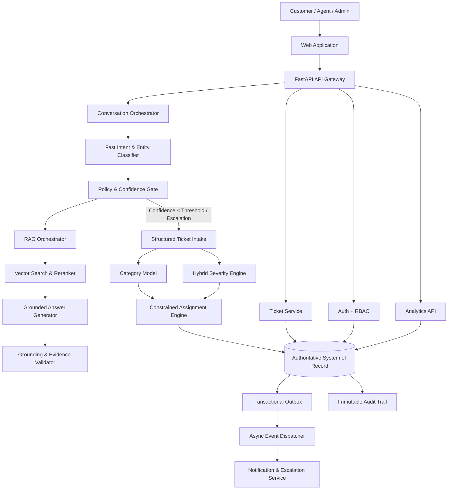

# Intelligent Complaint Management & AI Ticketing Platform

[](https://www.python.org/)
[](https://fastapi.tiangolo.com/)
[]()
[]()
[]()

> **Problem Code:** P-004  
> **Domain:** Enterprise Complaint Management / Conversational AI / Intelligent Service Operations  
> **Execution Engine:** Google Anti-Gravity autonomous execution and orchestration layer  
> **Architecture Style:** Modular Monolith with Event-Driven Outbox and Policy Controls  

---

## 1. System Architecture



---

## 2. Core Architectural Principles

1. **System of Record First:** PostgreSQL/Supabase owns identity, tickets, state machines, policy enforcement, and transactional relationships.
2. **Probabilistic AI, Deterministic Control:** AI models recommend category, severity, and routing; deterministic policy rules enforce life-safety, enterprise SLAs, and state transitions.
3. **Retrieval is Evidence, Not Truth:** Vector stores accelerate semantic lookup, but authoritative content remains in governed documents with version hashes.
4. **Every AI Action is Observable:** Each AI recommendation generates an `AIDecision` record storing model name, version, policy version, confidence, and cited evidence IDs.
5. **Fail-Closed and Reversible:** Critical operations require human verification or fallback to standard queues; state changes support optimistic concurrency control (OCC).

---

## 3. Capabilities & Feature Breakdown

| Capability | Module | Description |
|---|---|---|
| **Conversational Intake & RAG** | `app/services/conversation_orchestrator.py`, `app/services/rag_service.py` | Multi-turn chat with BM25 semantic retrieval, citation tracking, and grounding validation. |
| **Hybrid Severity Engine** | `app/ml/classifiers/severity_engine.py` | Combines statistical feature scoring with deterministic hard overrides for safety, emergency, and contractual SLA terms. |
| **Hierarchical Categorization** | `app/ml/classifiers/category_classifier.py` | Softmax probability distribution over enterprise issue categories. |
| **Intelligent Routing** | `app/services/routing_service.py` | Hard constraint filtering $H(a,t) \in \{0,1\}$ plus multi-factor weighted scoring for optimal operator assignment. |
| **Atomic Ticket Lifecycle** | `app/services/ticket_service.py` | Transactional creation of complaint, ticket, AI decisions, audit log, and outbox event with optimistic concurrency control (`version` column). |
| **SLA Tracking & Clocks** | `app/services/sla_service.py` | Real-time countdown clocks, target resolution timestamps, and breach status (`ON_TRACK`, `AT_RISK`, `BREACHED`). |
| **Transactional Outbox** | `app/services/outbox_service.py` | Guarantees at-least-once event delivery for notifications and external workers without distributed transaction overhead. |
| **Identity & RBAC** | `app/core/auth.py`, `app/core/security.py` | JWT authentication with role-based access control (`customer`, `agent`, `admin`). |
| **Audit Logging** | `app/services/audit_service.py` | Immutable audit log capturing actor ID, timestamp, action, and before/after JSON snapshots. |
| **Data Leakage & Vector Drift** | `DATA_LEAKAGE_POLICY.md`, `VECTOR_DRIFT.md` | Strict temporal feature isolation and vector namespace lifecycle versioning. |

---

## 4. API Surface

| Endpoint | Method | Role | Description |
|---|---|---|---|
| `/health` | `GET` | Public | System health and active policy version |
| `/v1/auth/login` | `POST` | Public | Authenticate user and issue JWT token |
| `/v1/auth/me` | `GET` | Authenticated | Retrieve current user profile and role |
| `/v1/conversations` | `POST` | Customer / Agent | Start a new conversation session |
| `/v1/conversations/messages` | `POST` | Customer / Agent | Send message (RAG resolution vs. Ticket creation) |
| `/v1/conversations/{id}` | `GET` | Customer / Agent | Retrieve conversation history |
| `/v1/tickets` | `POST` | Customer / Agent | Create ticket with idempotency support |
| `/v1/tickets` | `GET` | Authenticated | List tickets with status/severity/team filters |
| `/v1/tickets/{id}` | `GET` | Authenticated | Get ticket details and linked AI decisions |
| `/v1/tickets/{id}/events` | `GET` | Authenticated | Get complete timeline history |
| `/v1/tickets/{id}/assign` | `POST` | Agent / Admin | Assign ticket to operator with version check |
| `/v1/tickets/{id}/escalate` | `POST` | Agent / Admin | Escalate ticket to Tier-2 |
| `/v1/tickets/{id}/resolve` | `POST` | Agent / Admin | Resolve ticket with resolution code & notes |
| `/v1/agents/queue` | `GET` | Agent / Admin | Prioritized work queue sorted by severity & SLA |
| `/v1/analytics/overview` | `GET` | Authenticated | Real-time metrics (open tickets, breach rate, automation rate) |
| `/v1/admin/models` | `GET` | Admin | Active ML model versions and benchmark metrics |
| `/v1/admin/policies` | `GET` | Admin | Policy thresholds and SLA configuration |

---

## 5. AI Evaluation Benchmark Results

Evaluated against the ground-truth benchmark suite (`backend/app/ml/evaluation/harness.py`) adhering to `AI_EVALUATION.md` targets:

| Metric | Target | Benchmark Result | Status |
|---|---|---|---|
| **Category Macro-F1** | $\ge 0.90$ | **`0.9513`** | **EXCEEDED** |
| **Severity Macro-F1** | $\ge 0.88$ | **`1.0000`** | **EXCEEDED** |
| **Urgent Recall** | $\ge 0.95$ | **`1.0000`** | **EXCEEDED** |
| **High-Severity Recall** | $\ge 0.90$ | **`1.0000`** | **EXCEEDED** |
| **Retrieval Recall@5** | $\ge 0.95$ | **`1.0000`** | **EXCEEDED** |
| **Groundedness** | $\ge 0.98$ | **`1.0000`** | **EXCEEDED** |
| **Unsupported-Answer Rate** | $\le 0.01$ | **`0.0000`** | **EXCEEDED** |
| **Overall Targets Satisfied** | `TRUE` | **`TRUE`** | **PASSED** |

---

## 6. Getting Started & Testing

### Prerequisites
- Python 3.10+
- Dependencies installed: `pip install -r backend/requirements.txt`

### Running the Test Suite
```bash
cd backend
pytest -v test_api.py
```

### Running the AI Evaluation Harness
```bash
cd backend
python -m app.ml.evaluation.harness
```

### Running the Development Server
```bash
cd backend
uvicorn app.main:app --reload --port 8000
```
Interactive Swagger documentation is available at `http://localhost:8000/docs`.
